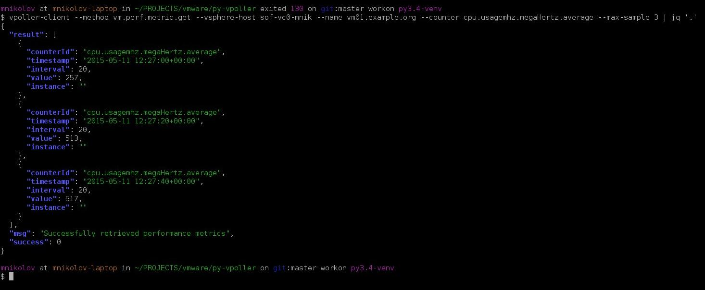

.. _examples:

========================
Example usage of vPoller
========================

This page provides some examples how vPoller can be
used to perform various operations like discovery and polling of
VMware vSphere objects.

Please also refer to the :ref:`methods` documentation
for the full list of supported vPoller methods you could use.

The property names which we use in these examples can be found in the
official `VMware vSphere API documentation`_.

Each vSphere managed object has specific properties, which are
documented in the official documentation.

The examples here serve for demonstration purpose only and do not
provide all the properties you could use and get from vSphere objects,
so make sure to refer to the official vSphere documentation when
looking for a specific property name.

There are also a number of posts about how vPoller is being used
for various purposes, which you could also read at the following
links:

* `VMware vSphere CLI tips & tricks with vPoller`_
* `VMware monitoring with Zabbix, Python & vPoller`_
* `Exporting Data From a VMware vSphere Environment For Fun And Profit`_

.. _`VMware vSphere CLI tips & tricks with vPoller`: http://unix-heaven.org/node/111
.. _`VMware monitoring with Zabbix, Python & vPoller`: http://unix-heaven.org/node/114
.. _`Exporting Data From a VMware vSphere Environment For Fun And Profit`: http://unix-heaven.org/node/116
.. _`VMware vSphere API documentation`: https://www.vmware.com/support/developer/vc-sdk/

Getting vSphere "about" info
============================

Using the ``about`` vPoller method you can retrieve information about
your vSphere host such as API version, vendor, build number, etc.

Here is an example of using the vPoller ``about`` method:

.. code-block:: bash

   $ vpoller-client --method about --vsphere-host vc01.example.org \
		--method about --properties version,fullName,apiVersion,vendor

Datacenter examples
===================

Here is how to discover all ``Datacenter`` objects from your vSphere
environment:

.. code-block:: bash
		
   $ vpoller-client --method datacenter.discover --vsphere-host vc01.example.org

An example command that would get the `summary.overallStatus`
property of a specific ``Datacenter``:

.. code-block:: bash

   $ vpoller-client --method datacenter.get --vsphere-host vc01.example.org \
		--name datacenter01 --properties name,overallStatus

ClusterComputeResource examples
===============================

A ``ClusterComputeResource`` managed object is what you are used to
refer to simply as ``cluster`` in vSphere. The examples commands below
show how to discover and get properties for your vSphere clusters.

An example command to discover all ``ClusterComputeResource``
managed objects from your vSphere environment:

.. code-block:: bash
		
   $ vpoller-client --method cluster.discover --vsphere-host vc01.example.org

And here is how to get the ``overallStatus`` property for a specific
``ClusterComputeResource`` managed object:

.. code-block:: bash

   $ vpoller-client --method cluster.get --vsphere-host vc01.example.org \
		--name cluster01 --properties name,overallStatus

HostSystem examples
===================

``HostSystem`` managed objects in vSphere are your ESXi hosts.

Here is an example how to discover all your ESXi hosts from your
vSphere environment:

.. code-block:: bash
		
   $ vpoller-client --method host.discover --vsphere-host vc01.example.org

And here is an example command to get the ``runtime.powerState``
property for a specific ``HostSystem`` object:

.. code-block:: bash

   $ vpoller-client --method host.get --vsphere-host vc01.example.org \
		--name esxi01.example.org --properties runtime.powerState

An example command to get all Virtual Machines registered on a
specific ESXi host:

.. code-block:: bash
		
   $ vpoller-client --method host.vm.get --vsphere-host vc01.example.org \
		--name esxi01.example.org

Here is how you can get all datastores used by a specific ESXi host:

.. code-block:: bash

   $ vpoller-client --method host.datastore.get --vsphere-host vc01.example.org \
		--name esxi01.example.org

VirtualMachine examples
=======================

An example command to discover all ``VirtualMachine`` managed
objects from your vSphere environment:

.. code-block:: bash
		
   $ vpoller-client --method vm.discover --vsphere-host vc01.example.org

Another example showing how to get the ``runtime.powerState``
property of a Virtual Machine:

.. code-block:: bash

   $ vpoller-client --method vm.get --vsphere-host vc01.example.org \
		--name vm01.example.org --properties runtime.powerState

This is how you could discover all disks in a Virtual Machine. Note,
that this method requires that you have VMware Tools installed and
running on the target Virtual Machine:

.. code-block:: bash
   
   $ vpoller-client --method vm.disk.discover --vsphere-host vc01.example.org \
		--name vm01.example.org

If you want to get information about a disk in a Virtual Machine you
could use the ``vm.disk.get`` vPoller method. This is how to get the
``freeSpace`` property for a Virtual Machine disk:

.. code-block:: bash
		
   $ vpoller-client --method vm.disk.get --vsphere-host vc01.example.org \
		--name vm01.example.org --properties freeSpace --key /var

In order to find out the host on which a specific Virtual Machine is
running on you could use the ``vm.host.get`` vPoller method:

.. code-block:: bash
		
   $ vpoller-client --method vm.host.get --vsphere-host vc01.example.org \
		--name vm01.example.org

The example below shows how to retrieve information about the network
that a Virtual Machine is using along with information about it's
IP address and MAC address:

.. code-block:: bash

   $ vpoller-client --method vm.guest.net.get --vsphere-host vc01.example.org \
		--name vm01.example.org --properties network,ipAddress,macAddress

If you want to see which datastores your Virtual Machine is using you
can use the ``vm.datastore.get`` vPoller method, e.g.:

.. code-block:: bash

   $ vpoller-client --method vm.datastore.get --vsphere-host vc01.example.org \
		--name vm01.example.org

Using the ``vm.process.get`` vPoller method we can get a list of all
processes running in a Virtual Machine. Note, that we need to supply a
username and password when using the ``vm.process.get`` method, which
are used for authentication in the guest system.

.. code-block:: bash

   $ vpoller-client --method vm.process.get --vsphere-host vc01.example.org \
		--name vm01.example.org --properties name,owner,pid,cmdLine \
		--guest-username root --guest-password p4ssw0rd

.. note::

   The above example command uses the ``root`` user for authentication
   in the guest system. It is recommended that you use a user
   with restricted privileges when using the ``vm.process.get``
   vPoller method if security is a concern.

Datastore examples
==================

Here is an example command which will discover all ``Datastore``
managed objects from your vSphere environment:

.. code-block:: bash

   $ vpoller-client --method datastore.discover --vsphere-host vc01.example.org

This example command below would return the ``summary.capacity``
property for a specific ``Datastore`` object.

.. code-block:: bash
		
   $ vpoller-client --method datastore.get --vsphere-host vc01.example.org \
		-name ds:///vmfs/volumes/5190e2a7-d2b7c58e-b1e2-90b11c29079d/ \
		--properties summary.capacity

This example command will give you all hosts, which are using a
specific ``Datastore``.

.. code-block:: bash

   $ vpoller-client --method datastore.host.get --vsphere-host vc01.example.org \
		--name ds:///vmfs/volumes/5190e2a7-d2b7c58e-b1e2-90b11c29079d/
		
Viewing established Sessions
============================

vPoller can also be used for viewing the established
sessions to your vSphere hosts.

.. note::

   Viewing vSphere sessions by unauthorized parties may be
   considered as a security hole, as it may provide an attacker
   with information such as Session IDs, which could be used for
   spoofing a user's session.

   If security is a concern make sure that your ``vSphere Agents`` are
   configured to use an account with restricted set of privileges,
   which cannot view the established vSphere sessions.

Here is an example command that will return the established sessions
for your vSphere host:

.. code-block:: bash

   $ vpoller-client --method session.get --vsphere-host vc01.example.org

Getting vSphere Events
======================

With vPoller you can also retrieve vSphere events.

This is how you can retrieve the last registered event from your
vSphere host:

.. code-block:: bash

   $ vpoller-client --method event.latest --vsphere-host vc01.example.org

Performance metrics
===================

Using vPoller you can retrieve various performance metrics from
your VMware vSphere environment.

In the following examples we will see how we can use vPoller in order
to discover the supported performance metrics in our vSphere environment
and also how to retrieve real-time and historical statistics from
different performance providers - ESXi hosts, Virtual Machines,
Datastores, Clusters, etc.

For more information about the performance metrics in a VMware vSphere
environment, please make sure to check the
`VMware vSphere API documentation`_ and especially the
`PerformanceManager documentation`_ where you can find
information about the supported performance counters, the existing
counter groups, description of each counter, etc.

.. _`VMware vSphere API documentation`: https://www.vmware.com/support/developer/vc-sdk/
.. _`PerformanceManager documentation`: http://pubs.vmware.com/vsphere-55/topic/com.vmware.wssdk.apiref.doc/vim.PerformanceManager.html

First, let's see how to obtain all performance counters that are
supported in our vSphere environment. Using the ``perf.metric.info``
vPoller method we can retrieve a list of all supported performance
counters from our vSphere environment.

.. code-block:: bash

   $ vpoller-client --method perf.metric.info --vsphere-host vc01.example.org

The result of the above command should contain all performance metrics
which are supported on the VMware vSphere host ``vc01.example.org``.

You can find a sample with all performance metrics as discovered on a
VMware vSphere host in the `perf-metric-info.json example file`_.

.. _`perf-metric-info.json example file`: https://github.com/dnaeon/py-vpoller/blob/master/extra/performance-metrics/perf-metric-info.json

We can also get the existing historical performance intervals by
using the ``perf.interval.info`` vPoller method, e.g.:

.. code-block:: bash

   $ vpoller-client --method perf.interval.info --vsphere-host vc01.example.org

On the screenshot below you can see an example of retrieving the
historical performance intervals on a vSphere host.

.. image:: images/vpoller-perf-interval-info.jpg

The historical performance intervals are used when we need to
retrieve historical metrics from performance providers.

In order to obtain information about the supported performance metrics
for a specific performance provider (e.g. ESXi host, Virtual Machine,
Datastore, etc.) you can use the respective ``*.perf.metric.info``
vPoller methods, e.g. ``vm.perf.metric.info``, ``host.perf.metric.info``,
etc.

The following example shows how to get the available performance
metrics for a Virtual Machine:

.. code-block:: bash

   $ vpoller-client --method vm.perf.metric.info --vsphere-host vc01.example.org \
		--name vm01.example.org

You can see an example result of using ``vm.perf.metric.info`` method
in the `vm-perf-metric-info.json example file`_, which shows the
available performance metrics for a specific Virtual Machine.

.. _`vm-perf-metric-info.json example file`: https://github.com/dnaeon/py-vpoller/blob/master/extra/performance-metrics/vm-perf-metric-info.json

In the `vm-perf-metric-info.json example file`_ you will see
that each discovered performance metric has a ``counterId`` and
``instance`` attribute, e.g.:

.. code-block:: json

   {
       "counterId": 149,
       "instance": "vmnic0"
   }

The above example metric shows that the performance counter ID is
``149`` and the instance is ``vmnic0``.

In order to find out what each counter ID is used for you
should lookup the counter ID in the result from the
``perf.metric.info`` vPoller method.

In our example with counter ID ``149`` if we check in the result
from the ``perf.metric.info`` vPoller method we would see what
this counter is used for, which in our case is this:

.. code-block:: json

   {
      "perDeviceLevel": 3,
      "level": 2,
      "key": 149,
      "nameInfo": {
        "label": "Data transmit rate",
        "key": "transmitted",
        "summary": "Average rate at which data was transmitted during the interval"
      },
      "groupInfo": {
        "label": "Network",
        "key": "net",
        "summary": "Network"
      },
      "unitInfo": {
        "label": "KBps",
        "key": "kiloBytesPerSecond",
        "summary": "Kilobytes per second"
      },
      "statsType": "rate",
      "rollupType": "average"
    },

We can also request specific counters only when using the
``*.perf.metric.info`` methods. For example if we are only interested
in the counters with ID ``149`` we would execute this command instead:

.. code-block:: bash

   $ vpoller-client --method vm.perf.metric.info --vsphere-host vc01.example.org \
		--name vm01.example.org --counter-id 149

An example result from the above command is shown below, which
contains all discovered counters with ID ``149`` and their instances.

.. code-block:: json

  {
    "success": 0,
    "result": [
      {
        "counterId": 149,
        "instance": "vmnic0"
      },
      {
        "counterId": 149,
        "instance": "vmnic1"
      },
      {
        "counterId": 149,
        "instance": ""
      },
      {
        "counterId": 149,
        "instance": "4000"
      }
    ],
    "msg": "Successfully retrieved performance metrics"
  }

Now, that we know how to get the available performance metrics for
our performance providers, let's now see how to retrieve the
actual performance counters for them.

In the following example we will see how to get the CPU usage in MHz
for a specific Virtual Machine.

In order to do that we will use the performance counter with ID ``6``,
which if you check in the `perf-metric-info.json example file`_ you
should see this:

.. code-block:: json

    {
      "perDeviceLevel": 3,
      "level": 1,
      "key": 6,
      "nameInfo": {
        "label": "Usage in MHz",
        "key": "usagemhz",
        "summary": "CPU usage in megahertz during the interval"
      },
      "groupInfo": {
        "label": "CPU",
        "key": "cpu",
        "summary": "CPU"
      },
      "unitInfo": {
        "label": "MHz",
        "key": "megaHertz",
        "summary": "Megahertz"
      },
      "statsType": "rate",
      "rollupType": "average"
    },

And here is how we would get three samples of the ``CPU usage in MHz``
performance metric.

.. code-block:: bash

   $ vpoller-client --method vm.perf.metric.get --vsphere-host vc01.example.org \
		--name vm01.example.org --max-sample 3 --counter-id 6

Here is an example result of the above command.

We can also retrieve the performance metrics for an instance, e.g.
get the CPU usage per core.

Running the following vPoller command would discover all instances
of performance counter with ID ``6``, so we can later use them
in our vPoller request.

.. code-block:: bash

   $ vpoller-client --method vm.perf.metric.info --vsphere-host vc01.example.org \
		--name vm01.example.org --counter-id 6

Here is an example screenshot showing the discovered instances.

.. image:: images/vpoller-vm-perf-metric-info-with-counter.jpg

If we want to retrieve the performance metrics for a specific
instance we would execute a similar command instead:

.. code-block:: bash

   $ vpoller-client --method vm.perf.metric.get --vsphere-host vc01.example.org \
		--name vm01.example.org --counter-id 6 --max-sample 3 --instance 0

.. image:: images/vpoller-vm-perf-metric-get-with-instance.jpg

We could also retrieve some interesting statistics from our
Datacenters and Clusters as well. In the following examples we will
see how to retrieve performance counter with ID ``256``,
which is described below (see `perf-metric-info.json example file`_
for more details as well):

.. code-block:: json

  {
      "perDeviceLevel": 3,
      "level": 1,
      "key": 256,
      "nameInfo": {
        "label": "VM power on count",
        "key": "numPoweron",
        "summary": "Number of virtual machine power on operations"
      },
      "groupInfo": {
        "label": "Virtual machine operations",
        "key": "vmop",
        "summary": "Virtual machine operations"
      },
      "unitInfo": {
        "label": "Number",
        "key": "number",
        "summary": "Number"
      },
      "statsType": "absolute",
      "rollupType": "latest"
    }

The ``vim.Datacenter`` and ``vim.ClusterComputeResource``
managed entities support historical statistics only, so in order to
retrieve any performance metrics for them we should specify a
historical performance interval.

The example command below retrieves performance counter with id ``256``
for one of our Datacenters, which would give us the number of virtual
machine power on operations for the past day.

.. code-block:: bash

   $ vpoller-client --method datacenter.perf.metric.get --vsphere-host vc01.example.org \
		--name MyDatacenter --counter-id 256 --perf-interval 1

Another example showing how to get performance counter with ID ``97``,
which returns the amount of host physical memory consumed by a virtual
machine, host, or cluster.

.. code-block:: bash

    $ vpoller-client --method host.perf.metric.get --vsphere-host vc01.example.org \
		--name esxi01.example.org --counter-id 97

An example result from the above command is shown below:

.. code-block:: json

   {
      "success": 0,
      "result": [
        {
          "instance": "",
          "value": 23899436,
          "interval": 20,
          "counterId": 97,
          "timestamp": "2015-02-10 14:52:20+00:00"
        }
      ],
      "msg": "Successfully retrieved performance metrics"
    }

As our last examples we will see how to retrieve various performance
metrics for ``vim.Datastore`` managed entities.

.. note::

   Some of the ``vim.Datastore`` performance metrics are retrieved
   by using the ``datastore.perf.metric.get`` vPoller method, while
   others are available via the ``host.perf.metric.get``, where a
   datastore metric is retrieved by using the Datastore instance.

   A ``vim.Datastore`` performance provider by itself provides only
   historical performance statistics.

   Most of the real-time statistics (e.g. ``datastoreIops``) are
   accessed via a ``vim.HostSystem`` performance provider.

The example below shows how to retrieve the ``datastoreIops`` for a
specific datastore.

In order to retrieve the ``datastoreIops`` we will use performance
counter with ID ``185`` (refer to the example
`perf-metric-info.json example file`_ for other metrics as well).

.. code-block:: json

    {
      "perDeviceLevel": 3,
      "level": 1,
      "key": 185,
      "nameInfo": {
        "label": "Storage I/O Control aggregated IOPS",
        "key": "datastoreIops",
        "summary": "Storage I/O Control aggregated IOPS"
      },
      "groupInfo": {
        "label": "Datastore",
        "key": "datastore",
        "summary": "Datastore"
      },
      "unitInfo": {
        "label": "Number",
        "key": "number",
        "summary": "Number"
      },
      "statsType": "absolute",
      "rollupType": "average"
    }

First we will discover all performance counters with ``185`` and
their instances from our example ESXi host ``esxi01.example.org``.

.. code-block:: bash

  $ vpoller-client --method host.perf.metric.info --vsphere-host vc01.example.org \
	--name esx01.example.org --counter-id 185

Example result from the above command is shown below, which contains
all instances of counters with ID ``185``, which represent our
Datastores.

.. code-block:: json

   {
    "success": 0,
    "result": [
      {
        "counterId": 185,
        "instance": "5481d059-dbd6de3d-2215-d8d385bf2110"
      },
      {
        "counterId": 185,
        "instance": "5485af07-7326ddc0-6afc-d8d385bf2110"
      },
      {
        "counterId": 185,
        "instance": "5485af4f-4dbf72e3-4980-d8d385bf2110"
      },
      {
        "counterId": 185,
        "instance": "5481d078-c2a2ef40-eb45-d8d385bf2110"
      },
      {
        "counterId": 185,
        "instance": "5485ab2d-50686078-b78f-d8d385bf2110"
      },
      {
        "counterId": 185,
        "instance": "5485afa4-344d2f22-96a2-d8d385bf2110"
      },
      {
        "counterId": 185,
        "instance": "52e173ac-1458ad64-2772-d8d385bf3138"
      },
      {
        "counterId": 185,
        "instance": "5481d01f-a4dea9fb-6027-d8d385bf2110"
      }
    ],
    "msg": "Successfully retrieved performance metrics"
  }

If we are interested in finding out the Datastore name for the
``5481d059-dbd6de3d-2215-d8d385bf2110`` instance from the above
example result we could use the ``datastore.get`` vPoller method to
do so. For example:

.. code-block:: bash

   $ vpoller-client --method datastore.get --vsphere-host vc01.example.org \
		--name ds:///vmfs/volumes/5481d059-dbd6de3d-2215-d8d385bf2110/ --properties name

And the result from the above command would give us the Datastore name.

.. code-block:: json

   {
    "success": 0,
    "result": [
      {
        "name": "datastore1",
        "info.url": "ds:///vmfs/volumes/5481d059-dbd6de3d-2215-d8d385bf2110/"
      }
    ],
    "msg": "Successfully retrieved object properties"
   }

Now, let's get back to the ``datastoreIops`` metric and retrieve it.

.. code-block:: bash

   $ vpoller-client --method host.perf.metric.get --vsphere-host vc01.example.org \
		--name esxi01.example.org --counter-id 185 --instance 5481d059-dbd6de3d-2215-d8d385bf2110

And here is an example result from the above command:

.. code-block:: json

   {
     "success": 0,
     "result": [
       {
         "instance": "5481d059-dbd6de3d-2215-d8d385bf2110",
	 "value": 84,
	 "interval": 20,
	 "counterId": 185,
	 "timestamp": "2015-02-10 15:48:40+00:00"
       }
     ],
     "msg": "Successfully retrieved performance metrics"
   }
