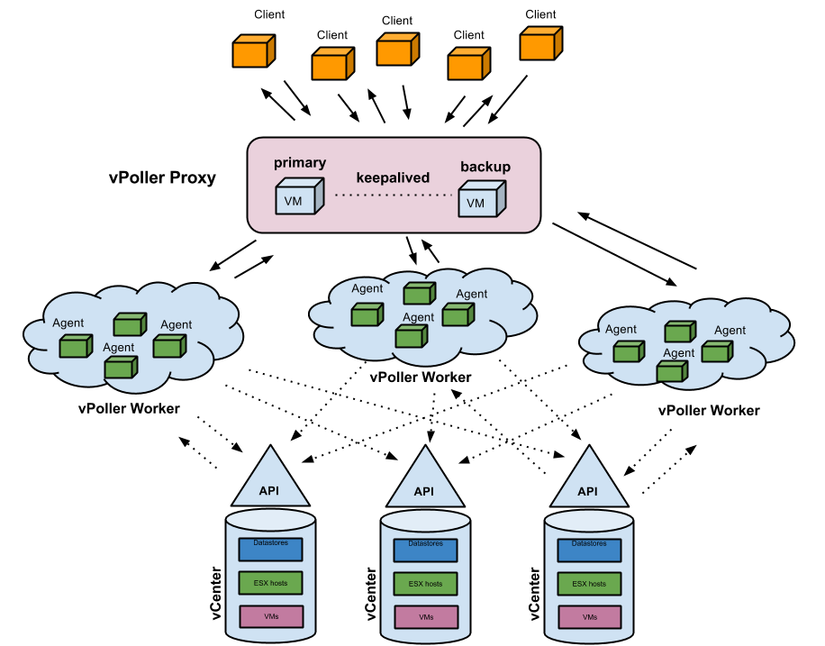

.. _terminology:

===========
Terminology
===========

``vPoller Proxy``
   ZeroMQ proxy which distributes tasks to and load balances client
   requests. The application running the ``vPoller Proxy`` is
   ``vpoller-proxy``.

``vPoller Worker``
   Worker application which processes tasks, such as discovery and
   polling of vSphere object properties. The ``vPoller Worker``
   receives new tasks for processing from the ``backend`` endpoint
   of a ``vPoller Proxy``. The application running the
   ``vPoller Worker`` is ``vpoller-worker``.

``vPoller Client``
   Client application used for sending task requests and receiving
   of results. The ``vPoller Client`` sends task requests to the
   ``frontend`` endpoint of a ``vPoller Proxy``. The application
   running the ``vPoller Client`` is ``vpoller-client`` and
   ``vpoller-cclient``, which is the client application written in C.

``vSphere Agent``
   The ``vSphere Agents`` are the ones that take care of establishing
   connections to the vSphere hosts and perform discovery and polling
   of vSphere objects. The ``vSphere Agents`` are running on the
   ``vPoller Workers`` and a single ``vPoller Worker`` can have
   as many ``vSphere Agents`` as you'd like. ``vSphere Agents`` are
   configured and managed by the ``vconnector-cli`` tool.

On the image below you can see how each vPoller component relates to
the others.

Here is what happens when you send a client task request:

1. A ``vPoller Client`` sends a task request to the
   ``frontend`` endpoint of a ``vPoller Proxy``.
2. Task request is received on the ``vPoller Proxy`` and is
   dispatched to any connected ``vPoller Workers`` on the ``backend``
   endpoint.
3. The task request is received on the ``vPoller Worker`` and given
   to a ``vSphere Agent`` which is taking care of the requested
   vSphere host for processing the request through the VMware
   vSphere API.
4. The ``vSphere Agent`` returns any result from the operation to the
   ``vPoller Worker`` which in turn sends the result through the
   ``vPoller Proxy`` back to the client which requested the task.
