.. _vpoller-zabbix:

===============================
vPoller Integration With Zabbix
===============================

One of the nice things about vPoller is that it can be easily
integrated with other systems.

In this documentation we will see how we can integrate vPoller with
`Zabbix`_ in order to start monitoring our VMware vSphere environment.

.. _`Zabbix`: http://www.zabbix.com/

.. note::

   This document is about VMware monitoring with vPoller and
   Zabbix, and **NOT** about VMware monitoring with stock Zabbix.

   If you are looking for VMware monitoring with stock Zabbix,
   please refer to the `official Zabbix documentation`_.

.. _`official Zabbix documentation`: https://www.zabbix.com/documentation/2.2/manual/vm_monitoring

Why use vPoller with Zabbix and not just use stock Zabbix for VMware monitoring?
================================================================================

There are many things that can be put here describing the reasons
and motivation why you might prefer having vPoller with Zabbix
integration instead of stock Zabbix, but eventually this would end
up being one long (and probably boring) story to write and tell.

You can read `this post here`_, which outlines some very good reasons
why you might want to have vPoller with Zabbix instead of stock
Zabbix when it comes to VMware vSphere monitoring.

.. _`this post here`: http://unix-heaven.org/node/114

Prerequisites
=============

This documentation assumes that you already have Zabbix installed
and configured.

Next thing you need to make sure is that you have vPoller installed,
configured and already running.

If you haven't installed and configured vPoller yet, please
refer to the :ref:`installation` and :ref:`configuration`
documentations first.

Enabling the vPoller Helpers for Zabbix
=======================================

In order to be able to integrate vPoller with Zabbix we need to
enable some of the vPoller helpers first.

Make sure that these vPoller helpers are enabled in your
``vPoller Workers``:

* vpoller.helpers.zabbix
* vpoller.helpers.czabbix

For more information about how to enable the helpers in your
``vPoller Workers``, please refer to the :ref:`helpers` documentation.

Importing the vPoller templates in Zabbix
=========================================

You can grab the latest `vPoller templates for Zabbix`_ from the Github
repo of vPoller.

.. _`vPoller templates for Zabbix`: https://github.com/dnaeon/py-vpoller/tree/master/extra/zabbix/templates

.. note::

   Some of the Zabbix items from the vPoller templates are disabled
   by default. It is recommended that you review each vPoller
   template and enable or disable the items that you need or
   don't need at all.

In the `vPoller templates for Zabbix`_ directory you will find two
directories:

* `vpoller-templates-externalchecks` - contains legacy templates to
  be used only with Zabbix external scripts
* `vpoller-templates-native` - contains the templates with native
  vPoller support for Zabbix. It is recommended that you always use
  the native vPoller support for Zabbix.
* `vpoller-templates-native-2.4` - same as the
  `vpoller-templates-native` templates, but for Zabbix 2.4.x releases.

Once you import the templates you should see the newly imported
vPoller templates.

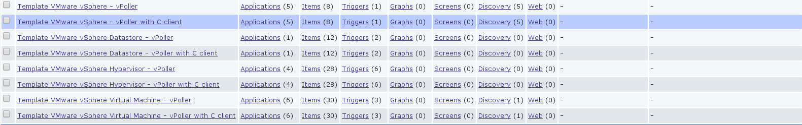

Native vPoller support for Zabbix
=================================

Native vPoller support for Zabbix makes it possible for
Zabbix to talk natively to vPoller via a `Zabbix loadable module`_

.. _`Zabbix loadable module`: https://www.zabbix.com/documentation/2.2/manual/config/items/loadablemodules

Native vPoller support for Zabbix is available only for Zabbix
release versions 2.2.x or above, as loadable modules in Zabbix
were introduced since the 2.2.x release of Zabbix.

Now, let's see how to build, install and configure the vPoller
loadable module for Zabbix.

First, make sure that you have the `ZeroMQ 4.x library`_ installed
as the vPoller loadable module for Zabbix is linked against it.

.. _`ZeroMQ 4.x library`: https://github.com/zeromq/zeromq4-x

Here is how to install the `ZeroMQ 4.x library`_ on your system
from source:

.. code-block:: bash

   $ git clone https://github.com/zeromq/zeromq4-x.git
   $ cd zeromq4-x
   $ ./autogen.sh
   $ ./configure
   $ make && sudo make install && make clean
   $ sudo ldconfig

Next thing you need to do is get the Zabbix source package for your
Zabbix release from the `Zabbix Download page`_. We need the
source package of Zabbix in order to build the vPoller loadable
module.

.. _`Zabbix Download page`: http://www.zabbix.com/download.php

Get the source package for your Zabbix release. For instance if you
are running Zabbix version 2.2.5 you should download the source
package for version 2.2.5 of Zabbix.

In the example commands below we are using the source package for
Zabbix version 2.2.5.

.. code-block:: bash

   $ tar zxvf zabbix-2.2.5.tar.gz
   $ cd zabbix-2.2.5
   $ ./configure

The next step we need to do is to grab the
`vPoller loadable module for Zabbix`_ from the
`Github repo of vPoller`_ and place the module in the
``zabbix-2.2.5/src/modules`` directory where you have unpacked the
Zabbix source package.

.. _`vPoller loadable module for Zabbix`: https://github.com/dnaeon/py-vpoller/tree/master/extra/zabbix/vpoller-module
.. _`Github repo of vPoller`: https://github.com/dnaeon/py-vpoller

.. code-block:: bash

   $ cp -a py-vpoller/extra/zabbix/vpoller-module zabbix-2.2.5/src/modules

Building the vPoller module for Zabbix is now easy.

.. code-block:: bash

   $ cd zabbix-2.2.5/src/modules/vpoller-module
   $ make

Running the ``make(1)`` command will create the shared library
``vpoller.so``, which can now be loaded by your Zabbix Server,
Proxy and Agents.

Let's now load the ``vpoller.so`` module in the Zabbix Server during
startup. In order to load the module you need to edit your
``zabbix_server.conf`` file and update the ``LoadModulePath`` and
``LoadModule`` configuration options. Below is an example snippet
from the ``zabbix_server.conf`` file, which loads the ``vpoller.so``
module.

.. code-block:: ini
		
   ####### LOADABLE MODULES #######
		
   ### Option: LoadModulePath
   #       Full path to location of server modules.
   #       Default depends on compilation options.
   #
   # Mandatory: no
   # Default:
   LoadModulePath=/usr/local/lib/zabbix
   
   ### Option: LoadModule
   #       Module to load at server startup. Modules are used to extend functionality of the server.
   #       Format: LoadModule=<module.so>
   #       The modules must be located in directory specified by LoadModulePath.
   #       It is allowed to include multiple LoadModule parameters.
   #
   # Mandatory: no
   # Default:
   LoadModule=vpoller.so

Make sure that you copy the ``vpoller.so`` module, which you've built
to your ``LoadModulePath`` directory.

.. code-block:: bash

   $ sudo cp zabbix-2.2.5/src/modules/vpoller-module/vpoller.so /usr/local/lib/zabbix

Once ready with the configuration changes make sure to restart any
service for which you've just updated the config file.

You can verify that the ``vpoller.so`` module has been successfully
loaded by inspecting your Zabbix logs. In the log snippet below
you can see that our Zabbix Server has successfully loaded
the ``vpoller.so`` module.

.. code-block:: bash

   13352:20140910:080628.011 Starting Zabbix Server. Zabbix 2.2.5 (revision 47411).
   13352:20140910:080628.012 ****** Enabled features ******
   13352:20140910:080628.012 SNMP monitoring:           YES
   13352:20140910:080628.012 IPMI monitoring:           YES
   13352:20140910:080628.012 WEB monitoring:            YES
   13352:20140910:080628.012 VMware monitoring:         YES
   13352:20140910:080628.012 Jabber notifications:      YES
   13352:20140910:080628.012 Ez Texting notifications:  YES
   13352:20140910:080628.012 ODBC:                      YES
   13352:20140910:080628.012 SSH2 support:              YES
   13352:20140910:080628.012 IPv6 support:              YES
   13352:20140910:080628.012 ******************************
   13352:20140910:080628.012 using configuration file: /etc/zabbix/zabbix_server.conf
   13352:20140910:080628.013 Loading vPoller module configuration file /etc/zabbix/vpoller_module.conf
   13352:20140910:080628.015 loaded modules: vpoller.so

The vPoller loadable module for Zabbix can use an optional
configuration file which allows you to manage some of the vPoller
settings, such as the task timeout, retries and endpoint of the
``vPoller Proxy`` to which task requests are being sent.

The configuration of the ``vpoller.so`` module resides in the
``/etc/zabbix/vpoller_module.conf`` file and you can find a sample
configuration file in the `vPoller loadable module for Zabbix`_
directory from the Github repo.

The Zabbix vPoller Key
======================

Once loaded the vPoller module for Zabbix exposes a single key of
type ``Simple check`` that can be used by your Zabbix items and is
called ``vpoller[*]``.

The ``vpoller[*]`` Zabbix key has the following form:

.. code-block:: bash

   vpoller[method, hostname, name, properties, <key>, <username>, <password>, <counter-id>, <instance>, <perf-interval>]

And the parameters that ``vpoller[*]`` key expects are these.

+-----------------+------------------------------------------------------+----------+
| Parameter       | Description                                          | Required |
+=================+======================================================+==========+
| method          | vPoller method to be processed                       | True     |
+-----------------+------------------------------------------------------+----------+
| hostname        | VMware vSphere server hostname                       | True     |
+-----------------+------------------------------------------------------+----------+
| name            | Name of the vSphere object (e.g. VM name, ESXi name) | True     |
+-----------------+------------------------------------------------------+----------+
| properties      | vSphere object properties to be collected by vPoller | True     |
+-----------------+------------------------------------------------------+----------+
| <key>           | Additional information to be passed to vPoller       | False    |
+-----------------+------------------------------------------------------+----------+
| <username>      | Username to use when logging into the guest system   | False    |
+-----------------+------------------------------------------------------+----------+
| <password>      | Password to use when logging into the guest system   | False    |
+-----------------+------------------------------------------------------+----------+
| <counter-id>    | Performance counter ID to be retrieved               | False    |
+-----------------+------------------------------------------------------+----------+
| <instance>      | Performance counter instance                         | False    |
+-----------------+------------------------------------------------------+----------+
| <perf-interval> | Historical performance interval                      | False    |
+-----------------+------------------------------------------------------+----------+

Note that some of the above parameters are mandatory and some are
optional depending on what vPoller method you are requesting to be
processed.

If your Zabbix Agents are also loading the ``vpoller.so`` module
you can use the ``zabbix_get(8)`` tool from the command-line in order
to send task requests to vPoller.

Here is one example that uses ``zabbix_get(8)`` in order check the
power state of VM using the ``vpoller[*]`` key.

.. code-block:: bash

   $ zabbix_get -s 127.0.0.1 -p 10050 -k "vpoller[vm.get, vc01.example.org, ns01.example.org, runtime.powerState]"
   "poweredOn"

Setting up vPoller externalscripts for Zabbix
=============================================

.. note::

   This section of the documentation provides instructions
   how to install the vPoller ``externalscripts`` in Zabbix.

   It is recommended that you always use the
   ``native vPoller support for Zabbix`` when integrating vPoller
   with Zabbix, and use ``externalscripts`` only if you cannot
   have the native vPoller support for Zabbix, e.g. you are
   running an older Zabbix release which doesn't support loadable
   modules or the loadable module is not available for your platform.

Get the ``vpoller-zabbix`` and ``cvpoller-zabbix`` wrapper scripts
from the links below and place them in your Zabbix
``externalscripts`` directory:

* https://github.com/dnaeon/py-vpoller/blob/master/extra/zabbix/externalscripts/vpoller-zabbix
* https://github.com/dnaeon/py-vpoller/blob/master/extra/zabbix/externalscripts/cvpoller-zabbix

You can also find user-contributed ``vpoller-zabbix`` and
``cvpoller-zabbix`` wrapper scripts, which come with more features
and safety checks at the links below:

* https://github.com/dnaeon/py-vpoller/blob/master/contrib/zabbix/externalscripts/vpoller-zabbix
* https://github.com/dnaeon/py-vpoller/blob/master/contrib/zabbix/externalscripts/cvpoller-zabbix

Using any of these wrapper scripts should be fine.

Place the ``vpoller-zabbix`` and ``cvpoller-zabbix`` wrapper scripts
into your Zabbix ``externalscripts`` directory and make sure they
are executable as well:

.. code-block:: bash

   $ sudo chmod 0755 $externalscripts/vpoller-zabbix $externalscripts/cvpoller-zabbix

Monitoring your VMware environment with vPoller and Zabbix
==========================================================

Time to start monitoring our VMware vSphere environment with vPoller
and Zabbix. Let's go ahead and add a VMware vCenter server and
get some data out of it.

Login to your Zabbix frontend and navigate to
``Configuration -> Hosts``, then at the top-right corner click on the
``Create host`` button. Fill in the hostname of the vCenter we are
going to monitor and add it to a group, e.g. vCenters in my case.

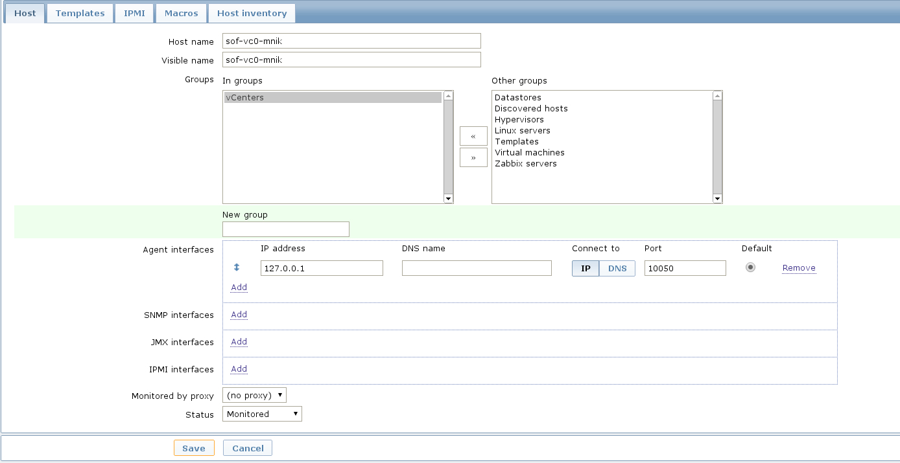

Next, click on the ``Templates`` and link the
``Template VMware vSphere - vPoller`` template if you are using
vPoller with external checks support or use the
``Template VMware vSphere - vPoller Native`` template for native
vPoller support in Zabbix.

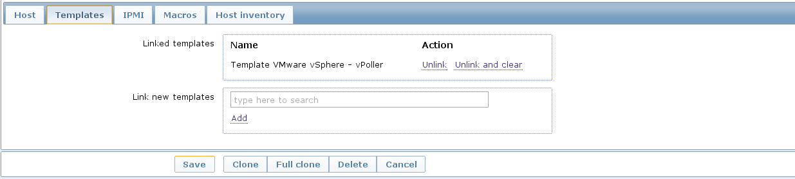

The last thing we need to do is add a Zabbix macro to our
vSphere host. Navigate to the ``Macros`` tab and add the
``{$VSPHERE.HOST}`` macro which value should be the hostname of the
vSphere host you are adding to Zabbix.

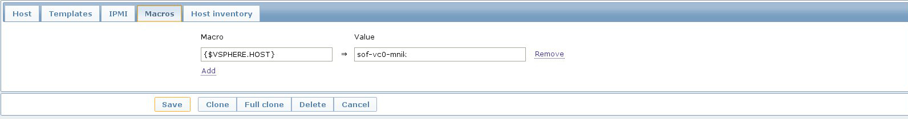

Once done, click the ``Save`` button and you are ready.

Soon enough Zabbix will start sending requests to vPoller which would
discover your vSphere objects (ESXi hosts, Virtual Machines,
Datastores, etc) and start monitoring them.

Importing vSphere objects as regular Zabbix hosts
=================================================

In the previous section of this documentation we have seen how we
can use Zabbix with vPoller working together in order to perform
monitoring of our VMware vSphere environment.

The way we did it is by using vPoller in order to discover VMware
vSphere objects and then use the `Zabbix Low-level discovery`_
protocol in order to create hosts based on the discovered data.

.. _`Zabbix Low-level discovery`: https://www.zabbix.com/documentation/2.2/manual/discovery/low_level_discovery

While ``Zabbix Low-level discovery`` is a powerful feature of Zabbix
which you could use in order to automate the process of discovering
and adding hosts to your Zabbix server, it still has some limitations
and disadvantages.

One disadvantage of using Zabbix LLD is that once a host is being
created by a Zabbix Discovery Rule that host becomes immutable -
you cannot manually change or update anything on the host,
unless these changes come from the discovery rule or the host profile
applied to the host.

You can imagine that this might be a bit of frustrating when you want
to group your hosts in a better way for example, which obviously you
cannot do since this host is now immutable.

Linking additional templates to a discovered host is also not
possible, which is another big issue. Now that you've discovered your
VMware Virtual Machines you probably wanted to link some additional
templates to them, but you will soon discover that this is not
possible either.

You cannot even add more interfaces to your hosts if needed...
Like mentioned earlier - your host is immutable, so that means
no changes at all after your hosts have been discovered with a
Zabbix LLD rule.

So, what can we do about it?

Well, we can solve this issue! And vPoller is going to help us do that! :)

We are going to use the `zabbix-vsphere-import`_ tool, which can
discover and import vSphere objects as regular Zabbix hosts -
that means that all vSphere objects (ESXi hosts, Virtual Machines,
Datastores, etc.) which were imported by the `zabbix-vsphere-import`_
tool would be regular Zabbix hosts, which you could update -
adding the host to groups you want, linking arbitrary
templates to it, etc.

.. _`zabbix-vsphere-import`: https://github.com/dnaeon/py-vpoller/tree/master/extra/zabbix/vsphere-import

First, let's create the config file which `zabbix-vsphere-import`_
will be using. Below is an example config file used by
``zabbix-vsphere-import`` tool:

.. code-block:: yaml

   ---
   vsphere:
     hostname: vc01.example.org
   
   vpoller:
     endpoint: tcp://localhost:10123
     retries: 3
     timeout: 3000

   zabbix:
     hostname: http://zabbix.example.org/zabbix
     username: Admin
     password: zabbix

   vsphere_object_host:
     proxy: zbx-proxy.example.org
     templates:
       - Template VMware vSphere Hypervisor - vPoller Native
     macros:
       VSPHERE.HOST: vc01.example.org
     groups:
       - Hypervisors

   vsphere_object_vm:
     templates:
       - Template VMware vSphere Virtual Machine - vPoller Native
     macros:
       VSPHERE.HOST: vc01.example.org
     groups:
       - Virtual Machines

   vsphere_object_datastore:
     templates:
       - Template VMware vSphere Datastore - vPoller Native
     macros:
       VSPHERE.HOST: vc01.example.org
     groups:
       - Datastores

In the example config file above we have defined various config
entries - Zabbix server, Zabbix Proxy which will be used,
vPoller settings and also templates to be linked for the various
vSphere objects.

As you can see the format of the configuration file allows for
flexible setup of your discovered vSphere objects.

Time to import our vSphere objects as regular Zabbix hosts.
To do that simply execute the command below:

.. code-block:: bash

   $ zabbix-vsphere-import -f zabbix-vsphere-import.yaml

Here is an example output of running the `zabbix-vsphere-import`_
tool:

.. code-block:: bash

   $ zabbix-vsphere-import -f zabbix-vsphere-import.yaml 
   [2014-09-06 10:33:28,420] - INFO - Connecting to Zabbix server at http://zabbix.example.org/zabbix
   [2014-09-06 10:33:28,537] - INFO - [vSphere ClusterComputeResource] Importing objects to Zabbix
   [2014-09-06 10:33:28,814] - INFO - [vSphere ClusterComputeResource] Number of objects to be imported: 1
   [2014-09-06 10:33:28,814] - INFO - [vSphere ClusterComputeResource] Creating Zabbix host group 'cluster01'
   [2014-09-06 10:33:28,904] - INFO - [vSphere ClusterComputeResource] Import of objects completed
   [2014-09-06 10:33:28,904] - INFO - [vSphere HostSystem] Importing objects to Zabbix
   [2014-09-06 10:33:29,122] - INFO - [vSphere HostSystem] Number of objects to be imported: 2
   [2014-09-06 10:33:29,289] - INFO - [vSphere HostSystem] Creating Zabbix host 'esxi01.example.org'
   [2014-09-06 10:33:30,204] - INFO - [vSphere HostSystem] Creating Zabbix host 'esxi02.example.org'
   [2014-09-06 10:33:30,658] - INFO - [vSphere HostSystem] Import of objects completed
   [2014-09-06 10:33:30,658] - INFO - [vSphere VirtualMachine] Importing objects to Zabbix
   [2014-09-06 10:33:30,775] - INFO - [vSphere VirtualMachine] Number of objects to be imported: 9
   [2014-09-06 10:33:30,935] - WARNING - Unable to find Zabbix host group 'Virtual Machines'
   [2014-09-06 10:33:30,936] - INFO - Creating Zabbix host group 'Virtual Machines'
   [2014-09-06 10:33:33,965] - INFO - [vSphere VirtualMachine] Creating Zabbix host 'ubuntu-14.04-dev'
   [2014-09-06 10:33:34,956] - INFO - [vSphere VirtualMachine] Creating Zabbix host 'centos-6.5-amd64'
   [2014-09-06 10:33:35,945] - INFO - [vSphere VirtualMachine] Creating Zabbix host 'sof-vc0-mnik'
   [2014-09-06 10:33:36,441] - INFO - [vSphere VirtualMachine] Creating Zabbix host 'test-vm-01'
   [2014-09-06 10:33:36,934] - INFO - [vSphere VirtualMachine] Creating Zabbix host 'sof-dev-d7-mnik'
   [2014-09-06 10:33:37,432] - INFO - [vSphere VirtualMachine] Creating Zabbix host 'ubuntu-12.04-desktop'
   [2014-09-06 10:33:43,430] - INFO - [vSphere VirtualMachine] Creating Zabbix host 'zabbix-vm-2'
   [2014-09-06 10:33:43,929] - INFO - [vSphere VirtualMachine] Creating Zabbix host 'zabbix-vm-1'
   [2014-09-06 10:33:44,432] - INFO - [vSphere VirtualMachine] Creating Zabbix host 'VMware vCenter Server Appliance'
   [2014-09-06 10:33:44,937] - INFO - [vSphere VirtualMachine] Import of objects completed
   [2014-09-06 10:33:44,937] - INFO - [vSphere Datastore] Importing objects to Zabbix
   [2014-09-06 10:33:45,046] - INFO - [vSphere Datastore] Number of objects to be imported: 1
   [2014-09-06 10:33:45,339] - INFO - [vSphere Datastore] Creating host 'ds:///vmfs/volumes/5190e2a7-d2b7c58e-b1e2-90b11c29079d/'
   [2014-09-06 10:33:45,607] - INFO - [vSphere Datastore] Import of objects completed

Generally you would want to run the import perhaps once an hour
(e.g. from ``cron(8)``), so that your Zabbix server is in sync with
your vSphere environment.

If you are importing your vSphere objects in Zabbix using the
``zabbix-vsphere-import`` tool make sure to disable any
Zabbix LLD discovery rules in order to avoid any conflicts between
them.

Agent-less process monitoring in Virtual Machines
=================================================

Another cool feature of vPoller is the ability to perform process
monitoring inside VMware Virtual Machines without the need of having
Zabbix Agents (or any other software) installed and running on your
systems.

This can be quite handy in situations where you don't have the
Zabbix Agents installed or you are not even allowed to install any
software on your Virtual Machines.

A good example is a service provider where customers request
that specific process availability be monitored in Virtual Machines,
but don't want to have any third-party software installed on the
customers' systems.

In case you are wondering how we perform the agent-less process
monitoring of VMware Virtual Machines using vPoller, you may want to
check the `vSphere API documentation for GuestProcessManager()`_.

.. _`vSphere API documentation for GuestProcessManager()`: http://pubs.vmware.com/vsphere-55/index.jsp#com.vmware.wssdk.apiref.doc/vim.vm.guest.ProcessManager.html

Let's see now how we can use vPoller with Zabbix integration in order
to provide agent-less process monitoring for our Virtual Machines.

First we will create a Zabbix item that will monitor the
total number of processes in a Virtual Machine and then we will see
how we can monitor the availability for certain processes.

The Zabbix key that we will use for agent-less process
monitoring is of type ``Simple check`` and has the following format:

.. code-block:: bash

   vpoller["vm.process.get", "{$VSPHERE.HOST}", "{HOST.HOST}", "cmdLine", "", username, password]

In the above Zabbix key the ``username`` and ``password`` parameters
should be a valid username and password that can login to the guest
system.

On the screenshot below we are creating a new Zabbix item that will
monitor the total number of processes in our Virtual Machine.

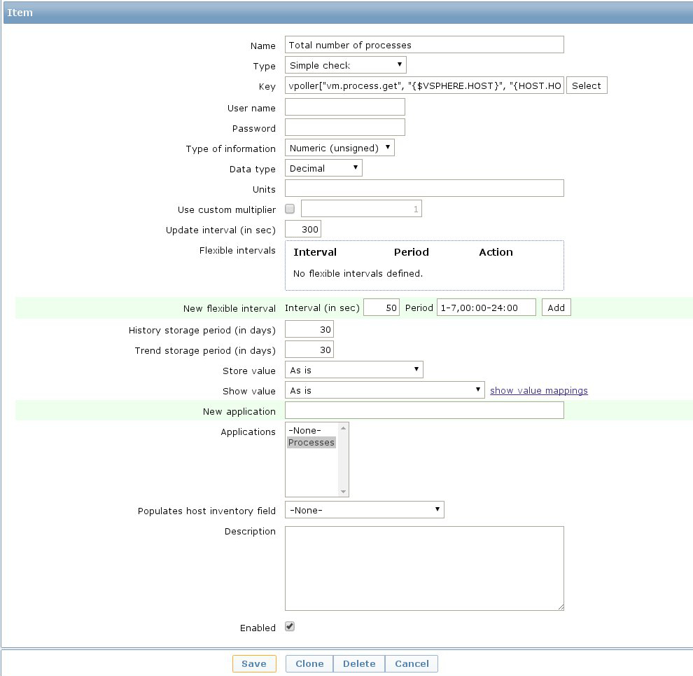

The key that we've used for monitoring the total number of processes
in our guest system is this:

.. code-block:: bash

   vpoller["vm.process.get", "{$VSPHERE.HOST}", "{HOST.HOST}", "cmdLine", "", root, p4ssw0rd]

We can also create a trigger for our item which will go into certain
state whenever the total number of processes exceeds a certain value.

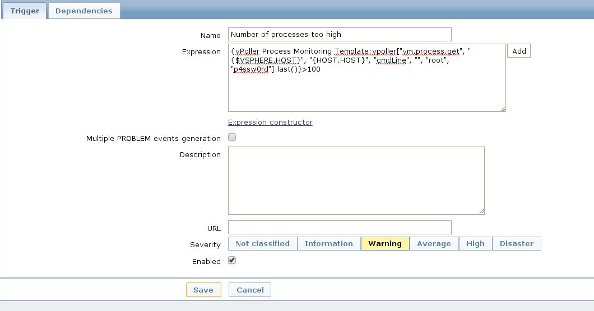

Now, let's add a second item which this time will be monitoring the
number of Apache processes in our Virtual Machine.

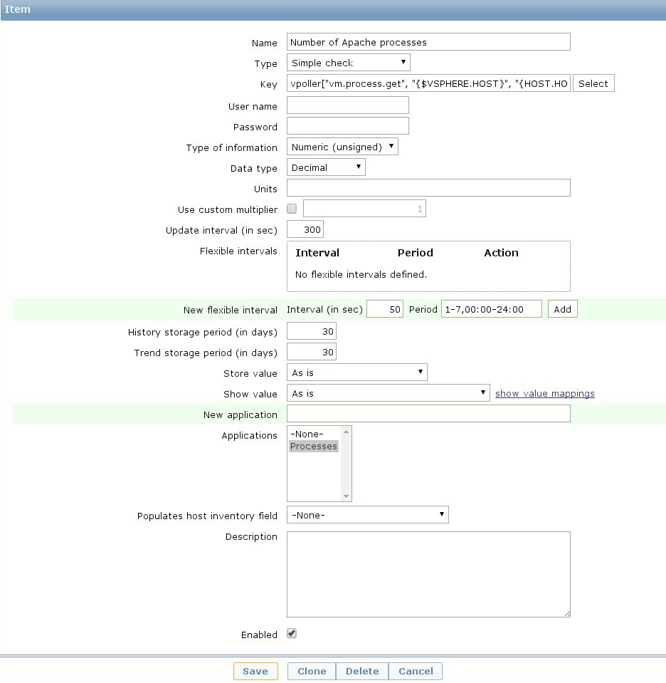

On the screenshot above we have used the following
Zabbix key in order to monitor the number of Apache processes in our
Virtual Machine.

.. code-block:: bash

   vpoller["vm.process.get", "{$VSPHERE.HOST}", "{HOST.HOST}", "cmdLine", "/usr/sbin/apache2", root, p4ssw0rd]

Should we want to be notified in case our process is not running we can
create a trigger for our item and set the severity level of the issue.

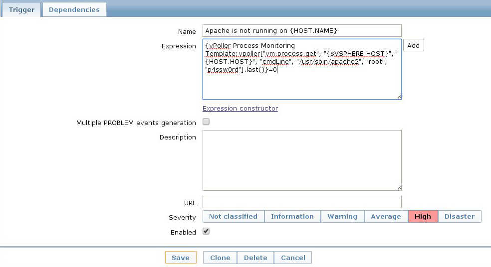

.. note::

   It is recommended that you use a system account with restricted
   set of privileges when you perform agent-less process monitoring
   with vPoller and Zabbix.

   You may also want to consider creating a global Zabbix macro
   for the system account username and password and use it in your
   Zabbix keys, without having the need to include the username and
   password in every single process-monitoring item that you
   want to have.

   Global macros in Zabbix can be created by navigating to
   ``Administration -> General -> Macros`` in your Zabbix Dashboard.

As a final example on agent-less process monitoring with vPoller and
Zabbix we will see how to query the number of process from the
command-line using the ``zabbix_get(8)`` tool.

Here's how to query the total number of processes in a Virtual
Machine from the command-line:

.. code-block:: bash

   $ zabbix_get -s 127.0.0.1 \
                -p 10050 \
		-k 'vpoller[vm.process.get, vc01.example.org, vm01.example.org, cmdLine, "", root, p4ssw0rd]'

And this is how to query the number of certain processes in a Virtual
Machine using ``zabbix_get(8)``:

.. code-block:: bash

   $ zabbix_get -s 127.0.0.1 \
                -p 10050 \
		-k 'vpoller[vm.process.get, vc01.example.org, vm01.example.org, cmdLine, "/usr/sbin/apache2", root, p4ssw0rd]'

Example screenshots
===================

Let's see some example screenshots of Zabbix monitoring a
VMware vSphere environment using vPoller.

Checking the latest data of our vCenter server in Zabbix:

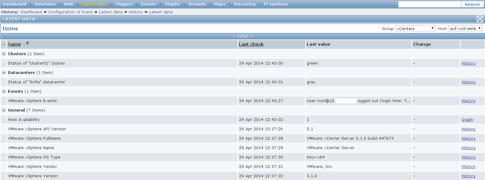

Let's see the latest data for some of our ESXi hosts:

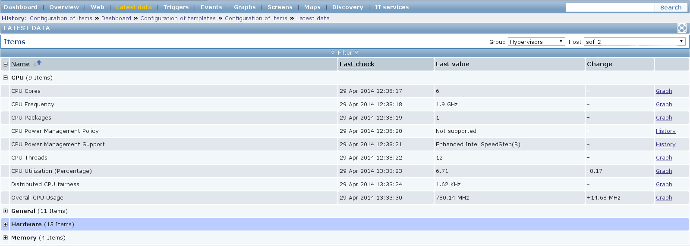

Another screenshot showing information about our ESXi host:

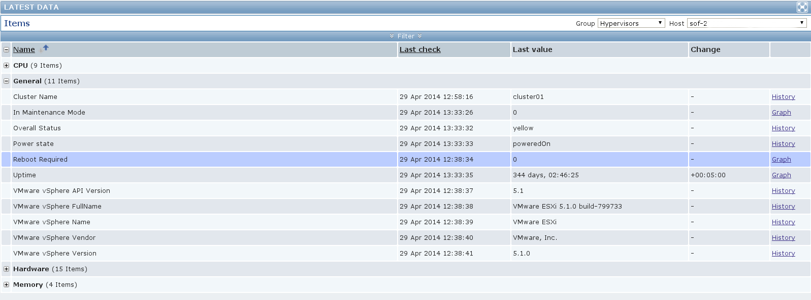

And another screenshot showing hardware related information about
our ESXi host:

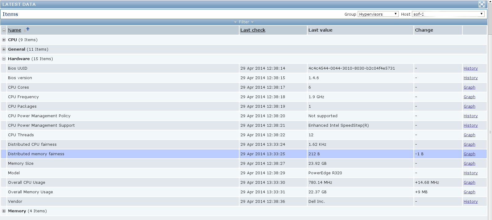

Let's check the latest data for one of our Virtual Machines:

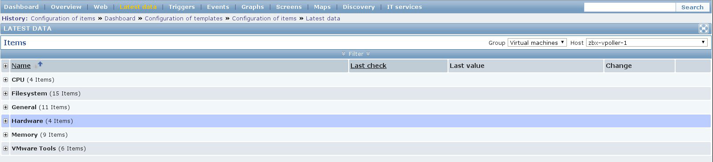

A screenshot showing information about the file systems in
Virtual Machine:

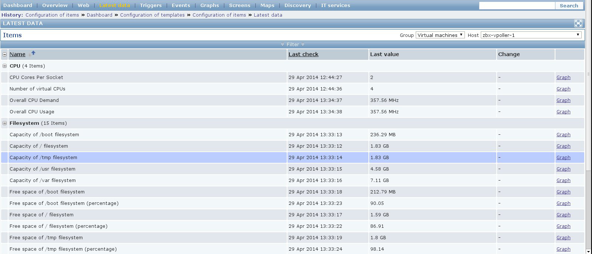

Another screenshot showing general information about a Virtual
Machine:

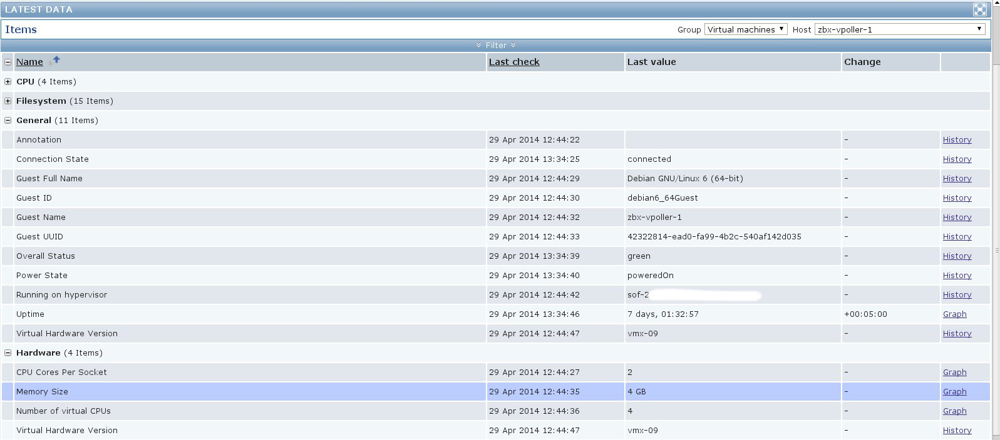

Another screenshot showing information about the memory and
VMware Tools for our Virtual Machine:

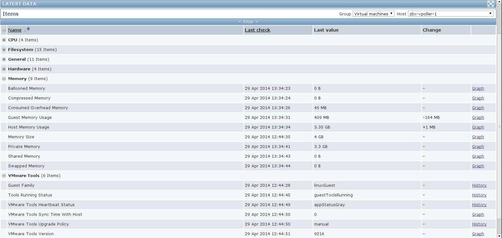

On the screenshot below you can see the discovered triggered alarms
for one of our vSphere Datacenters:

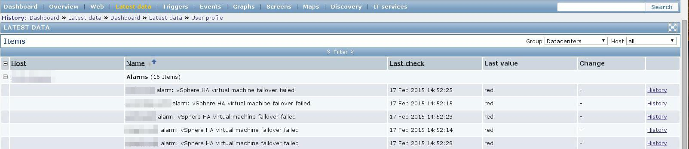

The screenshot below shows the Virtual Machine operations for the
past day for one of our VMware vSphere Datacenters:

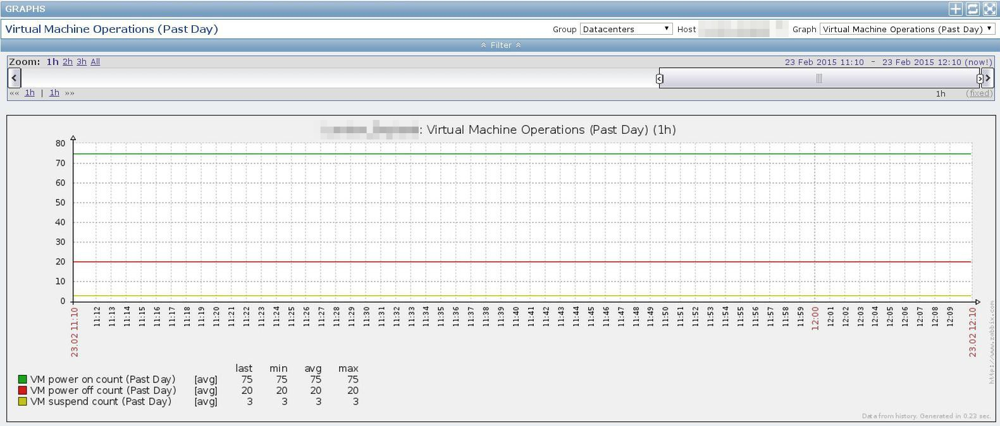

From the screenshot below we can see the data traffic for one of
our Virtual Machines.

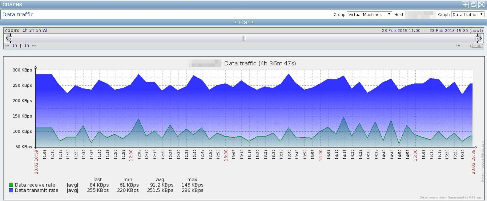
